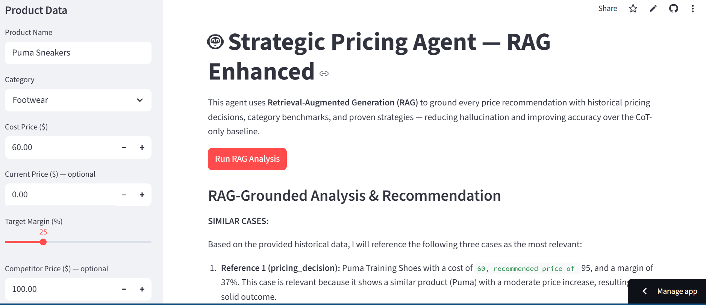

# Strategic AI Pricing Agent

An intelligent pricing agent powered by **Retrieval-Augmented Generation (RAG)** that provides data-backed price recommendations by retrieving relevant historical decisions, category benchmarks, and proven strategies before reasoning.

**Live Demo:** [pricing-agent-rag.streamlit.app](https://pricing-agent-rag.streamlit.app/)

---

## The Problem

Businesses lose money every day from bad pricing decisions — either undercutting themselves or pricing out of the market. Traditional AI agents guess based on general knowledge. This agent **retrieves real pricing history** before making a recommendation, making every suggestion traceable and trustworthy.

---

## How It Works

```
Your Input (product, category, cost, margin, competitor)
        │
        ▼
Semantic Search over Knowledge Base
        │
        ▼
Top 6 Relevant Documents Retrieved
(past decisions, benchmarks, guidelines)
        │
        ▼
LLM Reasons Over Retrieved Facts
        │
        ▼
Structured Recommendation with Citations
```

The key difference from a standard LLM prompt: the model never invents facts — it reasons over data you can see and verify.

---

## Screenshot



---

## Features

- **RAG Pipeline** — ChromaDB vector store with 19 curated pricing documents
- **Transparent Reasoning** — expandable panel shows exactly which documents were retrieved
- **Category Intelligence** — elasticity coefficients and margin benchmarks per category
- **Historical Grounding** — references real past pricing decisions and their outcomes
- **Fast Inference** — powered by Groq (Llama 3.1 8B) for near-instant responses
- **Interactive UI** — Streamlit dashboard for real-time scenario testing
- **Containerized** — Docker + Docker Compose for consistent deployment

---

## Knowledge Base

| Type | Count | Description |
|------|-------|-------------|
| Elasticity Benchmarks | 4 | Category-level demand sensitivity data |
| Historical Margins | 4 | Average and range margins per category |
| Past Pricing Decisions | 7 | Real product examples with outcomes |
| Pricing Guidelines | 4 | Proven rules for competitive positioning |

Categories covered: **Electronics · Footwear · Clothing · Luxury Goods**

---

## Tech Stack

| | |
|-|-|
| LLM | Groq — `llama-3.1-8b-instant` |
| Framework | LangChain |
| Embeddings | `all-MiniLM-L6-v2` via HuggingFace |
| Vector Store | ChromaDB |
| UI | Streamlit |
| Container | Docker + Docker Compose |

---

## Getting Started

### Prerequisites
- Python 3.11+
- Groq API key — get one free at [console.groq.com](https://console.groq.com)

### Local Setup

```bash
# Clone the repo
git clone https://github.com/KartikJaswal1111/pricing_agent_RAG
cd pricing_agent_RAG

# Create virtual environment
python -m venv venv
venv\Scripts\activate.bat        # Windows CMD
# source venv/bin/activate       # Mac/Linux

# Install dependencies
pip install -r requirements.txt

# Configure environment
cp .env.example .env
# Add your GROQ_API_KEY to .env

# Run
streamlit run app.py
```

Open `http://localhost:8501`

### Docker

```bash
cp .env.example .env
# Add your GROQ_API_KEY to .env

docker compose up --build
```

### Streamlit Community Cloud

The app is deployed and publicly accessible at [pricing-agent-rag.streamlit.app](https://pricing-agent-rag.streamlit.app/) — no setup required.

To deploy your own instance:
1. Fork this repo
2. Go to [share.streamlit.io](https://share.streamlit.io) and connect your GitHub
3. Set `GROQ_API_KEY` in the Secrets settings
4. Deploy

> **First run:** Downloads the embedding model (~90 MB) and builds the vector store. Subsequent runs load from cache and start instantly.

---

## Project Structure

```
├── app.py                  # Streamlit UI
├── pricing_agent_rag.py    # RAG agent, knowledge base, vector store
├── requirements.txt
├── Dockerfile
├── docker-compose.yml
├── .env.example
└── .gitignore
```

---

## License

MIT — [Kartik Jaswal](https://github.com/KartikJaswal1111)
